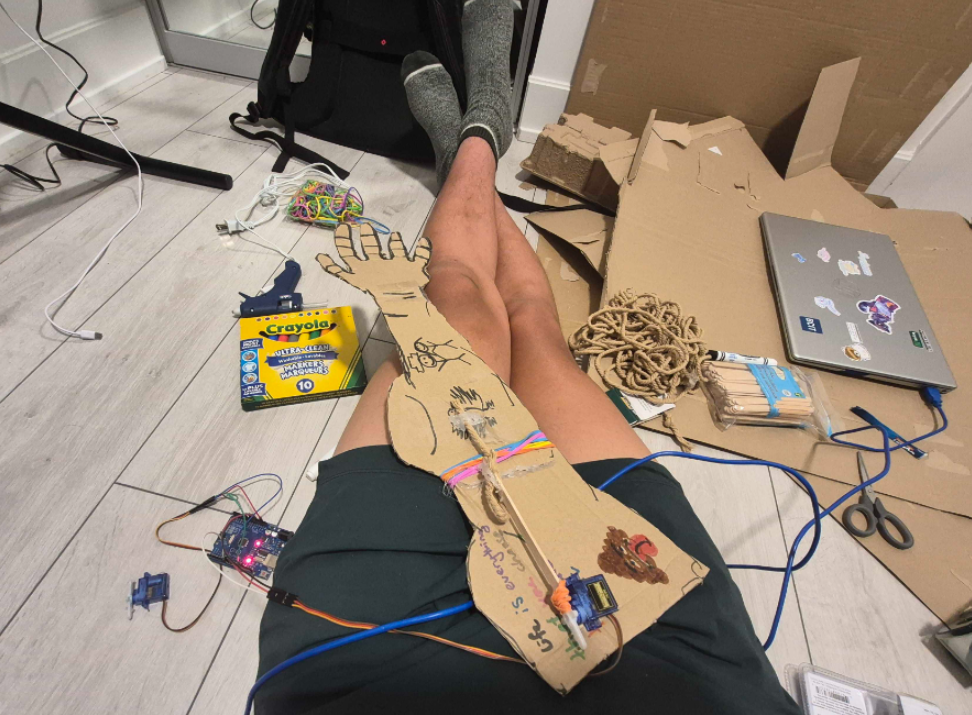
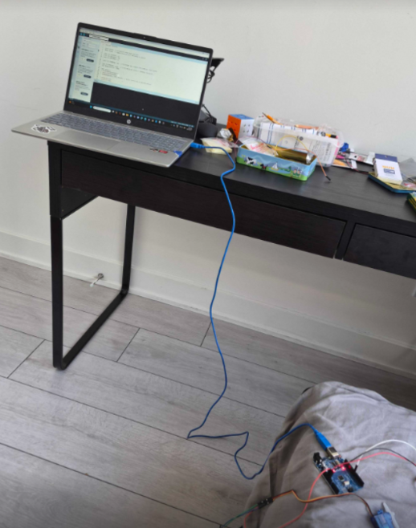

a cardboard robotic hand built with an Arduino Uno and two servo motors, controlled by custom code you iterated on extensively (adjusting rotation angles, speed, and direction). One servo ended up moving the wrist (after the forearm proved too heavy) while the other curled 3 fingers using a string-and-rubber-band tendon mechanism, all assembled from craft materials like cardboard, popsicle sticks, and hot glue. Along the way you debugged real wiring issues (wrong header pins), a servo library quirk causing unwanted snapping, and torque limitations that forced you to redesign the mechanics rather than just tweak the code — and you wrapped it up with a GitHub repo and an hour-by-hour markdown journal documenting the roughly 12-hour build across3 days.# Arduino robo hand
A robo hand using an Arduino uno and servos
 ## Build Photos

## Bill of Materials

| Item | Quantity | Notes |
|---|---|---|
| Arduino Uno | 1 | Main microcontroller |
| SG90 Servo Motor | 2 | One for wrist, one for finger |
| Cardboard | 1 box | Hand/arm structure |
| Popsicle sticks | ~5 | Servo horn extensions |
| String/thread | ~1m | Finger tendon mechanism |
| Rubber bands | ~5 | Finger return tension |
| Hot glue | 1 stick | Mounting servos, joints |
| Paper fasteners (brads) | ~3 | Hinge pivots |
| Jumper wires | ~6 | Arduino-to-servo connections |

PLEASE READ.
--->>>
This was my first hardware project for hc and I had not known that I was supposed to use lapse. I apologize and I shouldve known better, but I really dont want my hard 12 hours of work to go to waste.

This is allI wanted to justify before submitting again.

If there are any other problems, please dm me on slack @Michael maguel boi 